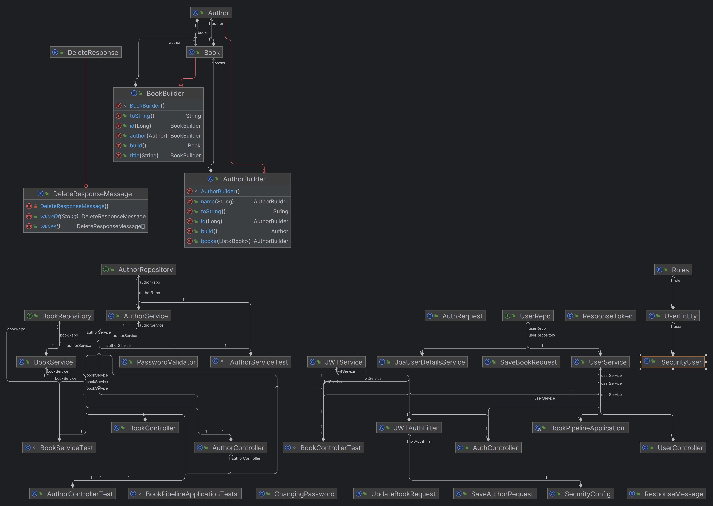

# BookPipeline Application Documentation

## Overview
The BookPipeline application is a Java-based web application developed using the Spring Boot framework. It is designed to manage books and authors in a library system. The application provides endpoints for creating, reading, updating, and deleting books and authors.

## Team Members and Responsibilities
### Samer Ismael
Samer worked on the login system of the application, ensuring that only authenticated users can access certain endpoints. He also handled the deployment of the application on AWS (Amazon Web Services), ensuring that the application is accessible on the internet.

### Kristoffer
Kristoffer was responsible for the development of the BookController. He implemented the endpoints for managing books, including creating, reading, updating, and deleting books. He also created the endpoint map, which is a guide to all the endpoints available in the application.

### Ellen
Ellen developed the AuthorController, which manages the authors in the system. She implemented the endpoints for creating, reading, updating, and deleting authors.

### Aram
Aram was responsible for writing the tests for the application. He ensured that all the endpoints work as expected and that the application is robust and reliable.

## Application Structure
The application is divided into several packages:
- entity: Contains the Book and Author entities. These are the main objects that the application manages.
- service: Contains the BookService and AuthorService classes. These classes contain the business logic for managing books and authors.
- repository: Contains the BookRepository and AuthorRepository interfaces. These interfaces define the methods for interacting with the database.
- model: Contains the SaveBookRequest and UpdateBookRequest classes. These classes define the data that the application expects when creating or updating a book.

## Endpoints
The application provides several endpoints for managing books and authors. 
The exact details of these endpoints, including their paths and the data they expect, 
can be found in the endpoint map appurl/swagger-ui/index.html.

## Testing
The application includes a suite of tests written by Aram. 
These tests ensure that the application works as expected and help to catch any bugs or issues.

### Deployment
The application is deployed on AWS using Elastic Beanstalk and CodeBuild in a pipeline to ensure smooth continuous deployment. 
This allows it to be accessed from anywhere on the internet.

